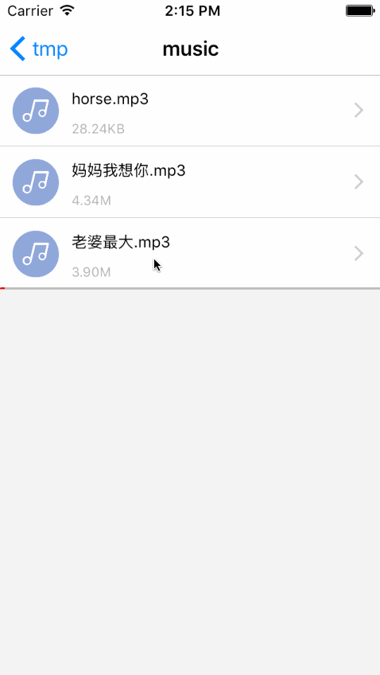
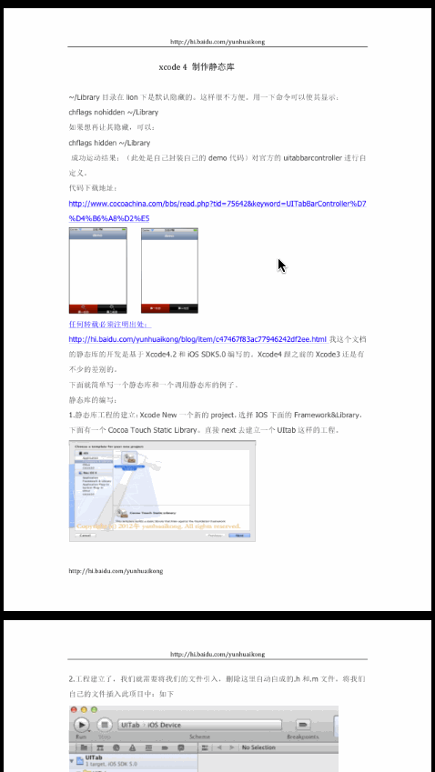
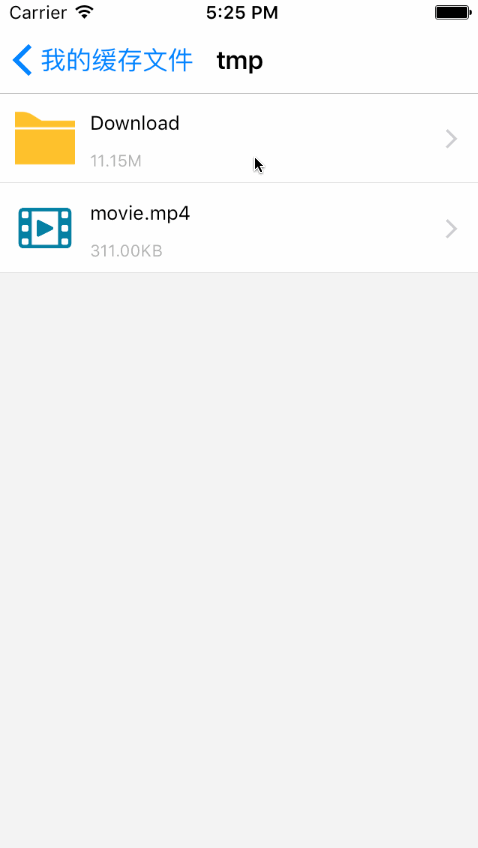
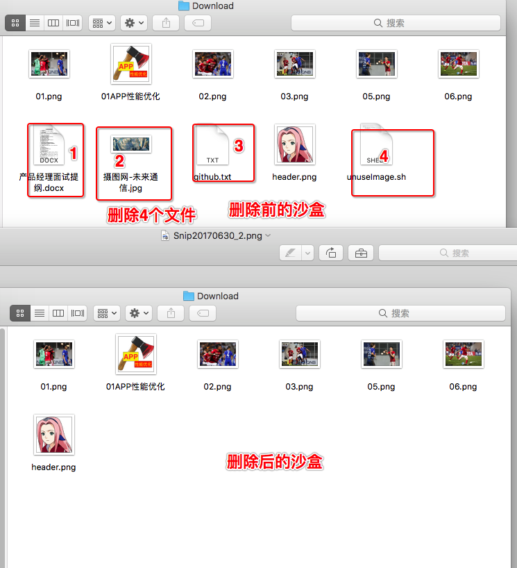

# SYCacheFileViewController
缓存文件视图控制器

* 显示指定目录下的子目录及文件
  * 子目录可以继续点击进入下级子目录，及显示下级文件
  * 文件可以点击查看，根据不格式进行展示，如音频播放、视频播放、doc/excel/ppt/pdf/txt等打开
* 目录与文件的删除操作
  * 左滑出现删除按钮
  * 系统文件及文件夹不可删除

# 效果图-目录与文件

# 效果图-图片查看

# 效果图-视频播放

# 效果图-音频播放

# 效果图-文档查看-word/excel/ppt/pdf

# 效果图-文档查看：txt/htm/……

# 效果图-删除操作（系统文件不可删除）

# 使用示例
~~~ javascript

// 导入头文件
#import "SYCacheFileViewController.h"

~~~

~~~ javascript

// 实例化 使用默认路径home
SYCacheFileViewController *cacheVC = [[SYCacheFileViewController alloc] init];
[self.navigationController pushViewController:cacheVC animated:YES];

~~~

~~~ javascript

// 实例化 自定义目录、标题
SYCacheFileViewController *cacheVC = [[SYCacheFileViewController alloc] init];
// 指定目录，或默认目录
NSString *path = [SYCacheFileManager documentDirectoryPath];
NSArray *array = [SYCacheFileManager fileModelsWithFilePath:path];
cacheVC.cacheArray = [NSMutableArray arrayWithArray:array];
// 其它属性设置
cacheVC.cacheTitle = @"我的缓存文件";
[self.navigationController pushViewController:cacheVC animated:YES];

~~~

>
> 特别说明：修改文件识别时，可以修改文件 SYCacheFileDefine.h 里的定义
>
> 1 修改音频文件类型：SYCacheFileAudioArray
>
> 2 修改视频文件类型：SYCacheFileVideoArray
>
> 3 修改文档类型：SYCacheFileDocumentArray
>
> 4 修改图片类型：SYCacheFileImageArray
>
> 5 修改系统文件类型：SYCacheFileSystemArray
>
>

# 修改完善
* 待完善
  * 文件删除后文件目录大小改变

